# 背景
倒腾旧电脑从硬盘里翻出了08年的绿宝石386存档，在各种幼年魔术师产物中翻出了少量正经存档，都是合理合规的怎么不能传到现在了！开搞！

走线路线：
- 模拟器：绿宝石386（基于日版） -> 日文原版绿宝石 -> 魂银（日版）-> 黑（美版）
- 3DS -> NS：Y -> Bank -> HOME

# 绿宝石386 -> 日版绿宝石
魔改的绿宝石386和NDS模拟器的slot2不兼容，只能先把386存档洗白到原版绿宝石再作打算。

## Related Works
如[宝可梦WIKI](https://emulation.gametechwiki.com/index.php/Game_Boy_Advance_emulators#Save_formats)所说，VBA早期的存档格式比较独特。且正好386是64KB的存档但原版是128KB，直接导入电池存档会导致白屏。
-   早期的版本对128KB存档不完全兼容，386的ROM可以导入128KB存档，导出只支持64KB。

但是，无论flash格式如何，在SRAM里格式至少肯定是一致的，再通过[*简单的观察*](#题外话)*可得*其内存安全也不是非常安全，可以考虑利用BUG进行存档迁移。

## 工具
古早玩意儿兼容性堪忧，只保证以下版本可以work：
- **GBA模拟器**：VBA v1.72简体中文修正版
    - VBA-m v2.1.11打不开386魔改版的ROM
- **ROM**：口袋吧原装386，日版绿宝石
    - 386是基于日版汉化+魔改的，虽然理论上英版日版的存档互通，但为了减少变量还是推荐用日版
- **存档**：386的`.sav`存档，如果是64KB需要转换，128KB理论和原版兼容

### 存档位置
VBA的`.sav`文件存放在ROM同一目录下，文件名和ROM相同仅后缀名为`.sav`。
理论上386的存档会是一个64KB的`.sav`，如果是128KB的话应该可以直接跳过转换步骤。

mGBA的`.sav`应该再GBA文件夹下，更新版本的VBA可以在BATTERY文件夹下找。

### 存档格式转换（复现失败）

参考[宝可梦wiki](https://bulbapedia.bulbagarden.net/wiki/Save_data_structure_(Generation_III))，G3的存档结构是已知的，也许可以按照[这篇帖子](https://projectpokemon.org/home/forums/topic/38362-converting-64kb-to-128kb-3rd-gen/)进行转换。
 - 手动搓了一下也许是操作失误也许是386魔改的原因总之没有成功
 - 感觉比较无聊就也没继续折腾

### 利用BUG迁移
根据SRAM中存档格式一致的推测，如果先打开游戏A的ROM及存档，并在**存档内容被clear掉之前**加载游戏B的ROM，且该ROM没有对应flash存档的前提下，理论上有概率可以**直接读取前一个游戏中SRAM对应内存区域**（不知道load具体逻辑是什么，但体感是优先检测有无`.sav`）。

为了加大成功概率，考虑在存档/读档（这时候可能会锁一下SRAM？）的同时load另一个ROM。

#### 具体步骤
0. **备份存档**，自动保存乃一生之敌
1. 所需食材
    - 386的ROM
    - 386的存档（64KB）
    - 日版绿宝石的ROM

    

    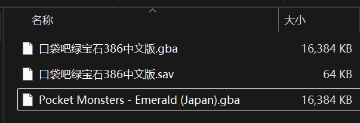
    

2. 用VBA打开386的ROM和存档，进游戏先保存一次，在存档结束前打开原版绿宝石的ROM（请勿断电时断电x）。
    
    建议切换ROM时保存的存档和现有存档保持一致（防止save真的不是原子操作导致存档损坏）

    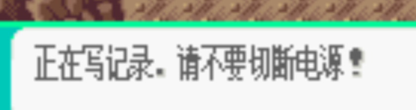

3. 严格按照上述操作大概率一次成功，迁移失败的话每次删掉原版自动产生的`.sav`再卡几次。注意即使是完全初始状态的ROM，切出时也会自动保存。
    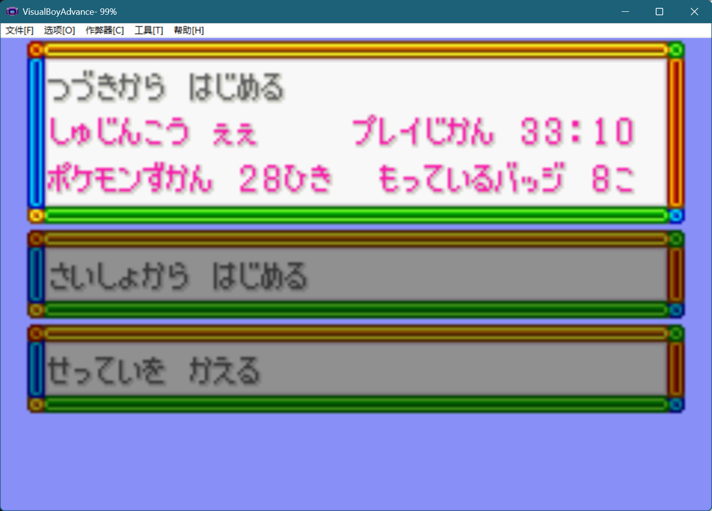

## 题外话
之所以推测是SRAM在两次load之间存在内存泄漏，主要是手滑打开红宝石时正好触发该（会导致死档的恶性）BUG。果然保存时不要断电是有道理的……

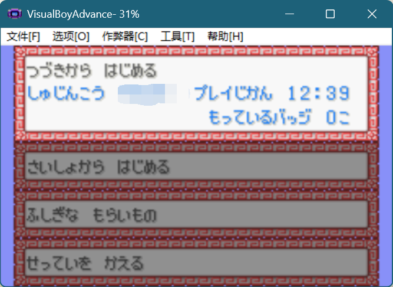
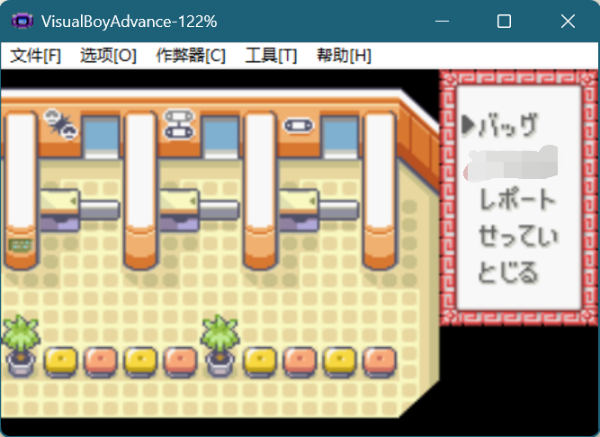

# 日版绿宝石 -> Gen4
- DeSmuME 
    - [Youtube](https://www.youtube.com/watch?v=QHKlnYfglFk)
    - [Trying Pal Park transfer from Pokemon Emerald to Pokemon Diamond on DeSmuME](https://gbatemp.net/threads/trying-pal-park-transfer-from-pokemon-emerald-to-pokemon-diamond-on-desmume.560355/)
- MelonDs （试过，和DeSmuME差不多，没啥软用）
- Mumu模拟器+DraStic（cite bilibili [宝可梦从GBA到nds nds到3dS 3ds模拟器到正版机器粗略演示](https://www.bilibili.com/video/BV1NV4y1p7em/?vd_source=89b3974c5e7d7c89a9b8550de9bf509c)，唯一一个识别到了gen3卡槽的）
- mention that 日版gen4只能读对应语言版本的gen3
- 如果能找到但是说存档损坏（日英双语方便搜索），在gen3游戏内save一下就好
    - Like this: 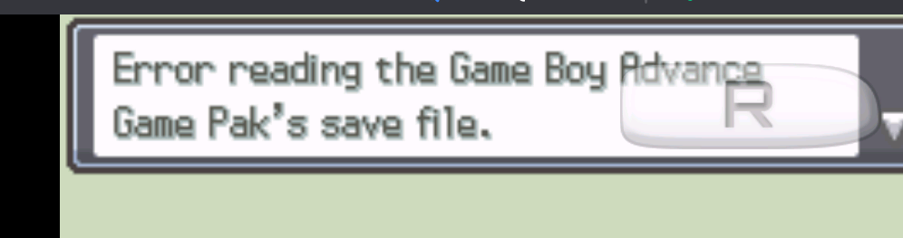 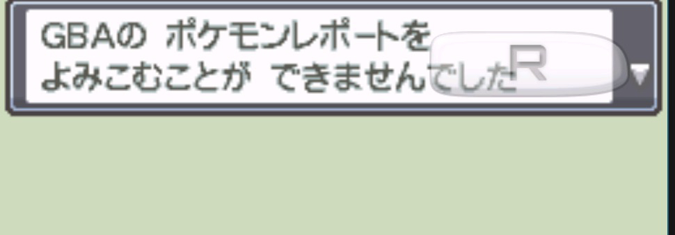

### 存档要求
- gen3 全国图鉴
    - [Pocket Monsters : Emerald [Japan]](https://wowroms.com/en/roms/nintendo-gameboy-advance/download-pocket-monsters-emerald-japan/13807.html)
    - [Pokemon - Emerald Version](https://www.emulatorgames.net/roms/gameboy-advance/pokemon-emerald-version/)
    - [Pokémon Ruby Version [save file] 2023-04-16](https://gbatemp.net/download/pokemon-ruby-version-save-file.37934/)
    - [Pokémon Emerald Version [save file] 2023-08-25](https://gbatemp.net/download/pokemon-emerald-version-save-file.38072/)
- gen4 在pal park
    - [SoulSilver ROM(JP)](https://www.emulatorgames.net/roms/nintendo-ds/pokemon-soul-silver-jp/)
    - [SoulSilver ROM(U)](https://www.emulatorgames.net/roms/nintendo-ds/pokemon-soulsilver-version/)
    - [Pokemon SoulSilver Version - Complete Save (100%) 1.1](https://gbatemp.net/download/pokemon-soulsilver-version-complete-save-100.38214/)

### 绿宝石386 -> 原版绿宝石
原版没法读取魔改版存档，用修改器直接写内存（修改器原作者: Fuzzier(Gauchyler@etang.com) ）

VBA v1和v2，v1能开魔改版，v2能开原版；修改器只能改v1的动态内存（因为存档compatibility的问题，都打算直接copy内存了，突然发现原版可以读取魔改版的存档内容，不用魔了）

## Gen4 -> Gen5

用到的功能应该是Download Play，目前支持这个的模拟器应该只有MelonDS。

### 存档要求
- gen4 大概不太有什么要求，但毕竟前一步都要求再pal park了，就默认在了吧
- gen5 需要人在传输工厂，和npc对话之后host这个传输过程

- **TODO**：把能用的ROM pairs放上来

### TroubleShooting
总是连接错误或者显示没有compatible的游戏卡带（根据各论坛的说法的诱因可能有：
- gen4和gen5的卡带语言版本不同（日版/美版/欧陆各语言版）
    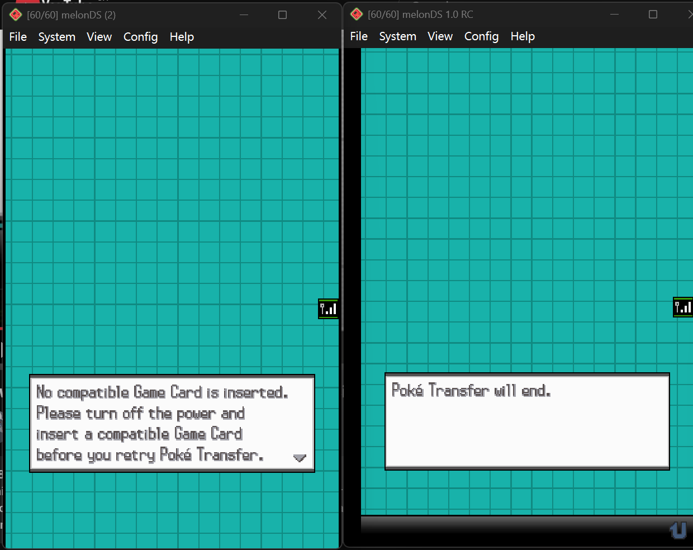
    *不兼容就是不兼容（被气到想直接PKHex复制内存的程度）*
- 存档和卡带的语言版本不同可能会有影响？（总之为了减少无关变量我全改成了英文版存档，但理论上没问题）
    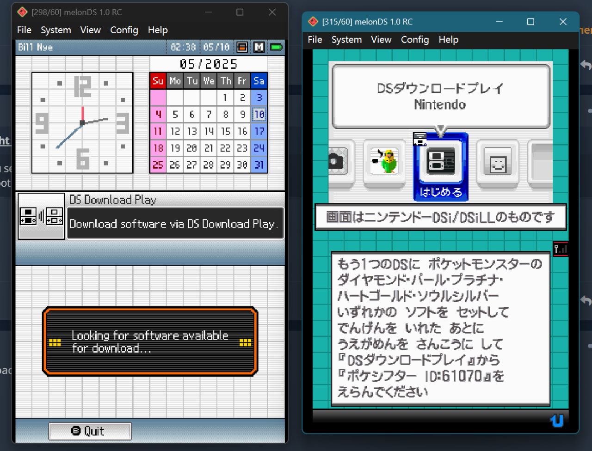
    *不建议这么干（以及直接用DSi的Console比较好）*
- 为了防止引入奇怪变量，建议时不时用PKHex检查存档及pokemon的合法性（毕竟从奇妙改版掏出来的东西或多或少有机会不对劲） 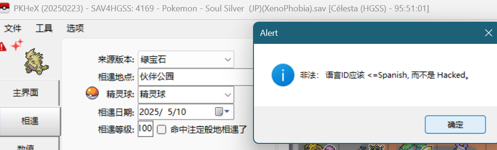

### 步骤记录
- 虽然其他教程说直接用DS的BIOS7和BIOS9 firmware就可以work，但可能年代久远（？），最后我是用了melonDS的DSi模拟器，并且gen4作为wifi的host机，gen5加入连接才成功的（不太清楚为什么反过来容易连接错误（比如这样：
    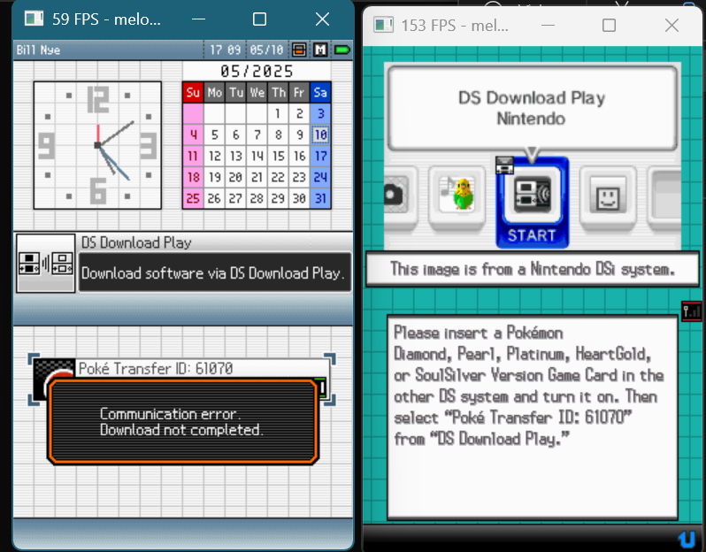
- 多个教程均提到帧率越高越容易成功链接（不知道原理）。实操的时候建议melonDS双开的时候可以一个关掉帧率限制，另一个用快捷键控制是否锁帧（回自动同步），如果直接两个都开无限制的话会卡死闪退。
- 成功了大概是这样，选就完事了
    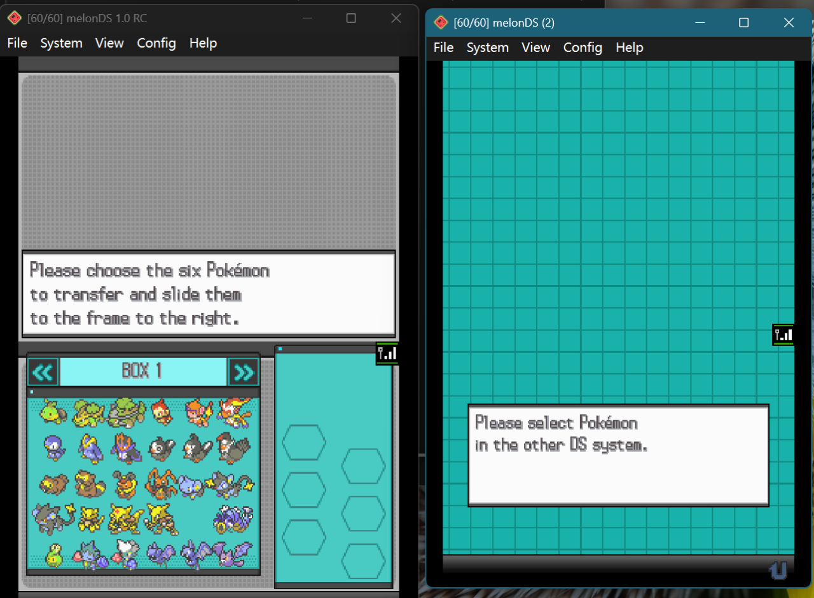

### 碎碎念
- 捕捉的套圈小游戏还挺好玩的，接下来不知道直接送去实体机还是先送到gen6再去实体机（反正gen6就可以进bank，懒得再折腾去日月了（绝对不是因为充了一个月home会员不想续费，也不是因为做毕设和期末考试太忙，嗯嗯））

## Gen6 -> Bank -> Home
有3ds实体机所以毫无技术含量，对Gen6的存档没有任何要求，只要box里有pkm就行（以及3ds能联网）
### Gen6 -> Bank
进Bank，好像需要注册一个3ds账号，全免费直接照着做就行，然后就是呆呆兽也可以学会的简单操作
### Bank -> Home
难度极高，主要体现为需要给Home氪金

# Reference
- 感觉是市面上最全的一个: [Guide: How to transfer a Pokemon through different generations using emulation](https://www.reddit.com/user/Porta_14/comments/lxbjwv/guide_how_to_transfer_a_pokemon_through_different/#:~:text=In%20your%20generation%204%20games,your%20save%20file%20as%20a%20%5B.)

- [贴吧沙奈朵真爱哥（【攻略】来自漆黑的全缎带沙奈朵travel in time and space）](https://tieba.baidu.com/p/6508898552?pn=1)）